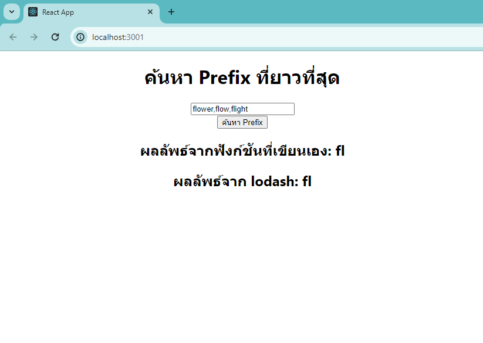

# Longest Common Prefix React App

>**Note**: This is a simple React application that demonstrates how to find the longest common prefix among a list of strings. The application allows users to input a list of strings and calculates the longest common prefix among them.

## Installation

- To get started with this project, clone the repository and install the necessary dependencies:

```bash 
git clone https://github.com/6010110455/mydev_health_plaza_QuizApp.git
cd mydev_health_plaza_QuizApp
npm install
```

## Usage

- To run the application, use the following command:

```bash 
npm start
```

- Open your browser and navigate to http://localhost:3000 to see the application in action.



## How It Works

- The application consists of a single React component that handles user input and calculates the longest common prefix.

### Components

- **LongestCommonPrefixComponent**: This component handles the user interface and logic for calculating the longest common prefix. It maintains the state of the input strings and the resulting common prefix.

## Technologies Used

- React: A JavaScript library for building user interfaces.
- TypeScript: A typed superset of JavaScript that compiles to plain JavaScript.